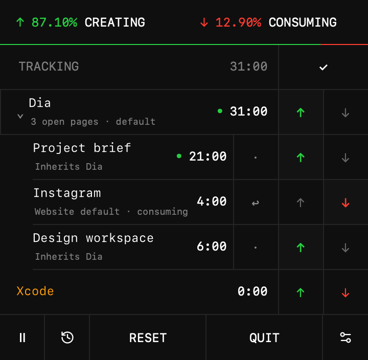

# Ratio

Create more. Consume less.



[Download Ratio for macOS ⬇](https://github.com/tjcages/ratio/releases/latest/download/Ratio.dmg)

Universal app for Apple silicon and Intel · macOS 12 or newer · [All releases](https://github.com/tjcages/ratio/releases)

Ratio is a macOS menu-bar app that measures time in the active app or browser site, then lets you classify that time as creating or consuming. It shows the balance in the menu bar and keeps a local daily history.

## Install

1. [Download `Ratio.dmg`](https://github.com/tjcages/ratio/releases/latest/download/Ratio.dmg), open it, and drag **Ratio** into **Applications**.
2. Open Ratio from Applications. These builds are not notarized by Apple, so the first launch is blocked: open **System Settings → Privacy & Security** and click **Open Anyway** next to Ratio. (On macOS 14 and earlier you can instead right-click Ratio and choose **Open**.)
3. Ratio lives in the menu bar and opens at login by default. Change that, or switch between dark and light, from the settings button in the bottom-right corner of the panel.

To update, download the latest release and replace the app in Applications; your history and classifications are kept. **Personal Builds…** in Ratio's right-click menu opens the releases page. macOS may ask for browser Automation access again after an update.

This is a personal build of [Visualize Value's Ratio](https://ratio.visualizevalue.com/) without purchase prompts. The application source is available under GPL-3.0.

## What it records

- Ratio counts time only for the foreground window.
- Ratio detects compatible tab interfaces from installed browsers’ scripting dictionaries. This covers Safari-style and Chromium-style interfaces, including active/current/selected-tab variants, without requiring each browser brand in a fixed list. Only the foreground page accumulates time.
- Browsers without a compatible tab interface (including Firefox/Zen) retain app-level tracking. Full tab support cannot be guaranteed across every browser; browser Automation permission is also required.
- Expand a browser with the chevron to see its pages. Ordinary pages inherit the browser's creating/consuming setting. Common social sites default to consuming, including Facebook, Instagram, Threads, X, TikTok, Reddit, LinkedIn, Bluesky, YouTube, and other domains listed in `consumeSites`. Subdomains match; lookalike domains do not. Explicit page choices take precedence over website defaults. Use **↩** to restore the browser default. Changing the browser default preserves page overrides. Restoring inheritance on a social page explicitly uses the browser default instead of the website default. Federated social networks with custom domains are not universally identifiable.
- Browser totals include their pages once. Reclassification updates today's time. Closed pages with recorded time remain visible for the day; duplicate tabs with the same URL share one page entry.
- Page rules are specific to a browser and URL (including its query, excluding its fragment). Ratio saves a SHA-256 page identifier and hostname locally, never the full URL or page title. Titles appear while known in the current session; after relaunch, closed pages display their hostname. Earlier versions' website entries remain separate because they do not identify the originating browser.
- Allow browser access under **System Settings → Privacy & Security → Automation → Ratio** when macOS asks. If access is unavailable, Ratio continues tracking the browser as an app and shows an explanation when expanded. Browser-internal pages use the browser's default.
- Right-click an app or page to **Hide app/page from list** or **Delete today’s usage**. Hiding persists across restarts and keeps tracking, totals, and classifications. Use **Hidden apps and pages** in an activity context menu or Ratio’s menu-bar context menu to show it again.
- Deleting a browser’s usage removes today’s browser time and all its page time; deleting one page leaves its siblings intact. Past days and classifications stay unchanged. Future activity starts counting again. **Undo usage deletion** restores the latest deletion without losing newly recorded activity; undo lasts until another deletion, a full reset, a new day, or app exit.
- Notification Center is excluded from recording, today’s saved activity, and activity lists.
- Overflowing titles pause for two seconds, then scroll at a steady speed with pauses at either end. Hidden titles stop; macOS Reduce Motion keeps titles still. Full titles remain available in tooltips and accessibility labels.
- App usage, classifications, daily history, and preferences stay in macOS UserDefaults on your Mac.
- **Open at login** uses the macOS login item list (macOS 13 or newer). It is on by default at first launch; turning it off in Settings is remembered. If macOS needs approval, **On** opens Login Items in System Settings.
- Visualize Value's signed build can share one anonymous cumulative tracked-time total. It never sends app names, site names, window titles, classifications, or daily history. Copies without a Visualize Value purchaser credential, including these releases, never report. It can be disabled from **Share Anonymous Total** in the right-click menu.

See [`native/Sources/main.swift`](native/Sources/main.swift) for the complete implementation.

## Requirements

- macOS 12 or newer
- Intel or Apple silicon
- Xcode command-line tools

## Build the Mac app

```sh
git clone https://github.com/tjcages/ratio.git
cd ratio/native
./build.sh
open Ratio.app
```

`build.sh` creates a universal Intel/Apple-silicon app, applies an ad-hoc local signature, and runs the accounting self-tests. `./package.sh` also builds `dist/Ratio.dmg` and `dist/Ratio.zip`. `Ratio.app/Contents/MacOS/Ratio --preview <folder>` runs the interface checks and saves screenshots to that folder.

## Releasing

GitHub Actions builds, tests, and packages every pull request and push (see `.github/workflows/build.yml`); the DMG, zip, and interface screenshots are attached to each run. To publish a release, increment `CFBundleShortVersionString` and `CFBundleVersion` in `native/Ratio.app/Contents/Info.plist` and update `RELEASE-NOTES.md`. When that reaches `main`, the workflow creates release `v<version>` and the download link above points to it. Never change the bundle identifier; it keeps existing users' data.

## Contributing

Issues and focused pull requests are welcome. Please keep the interface compact, preserve local-first tracking, and do not add collection of app names, sites, window titles, or browsing history.

## License

Ratio's application source is licensed under [GNU GPL v3](LICENSE). The Ratio name, icon, and Visualize Value name are trademarks or brand assets and are not granted for use by the GPL software license. Third-party components retain their own licenses.
